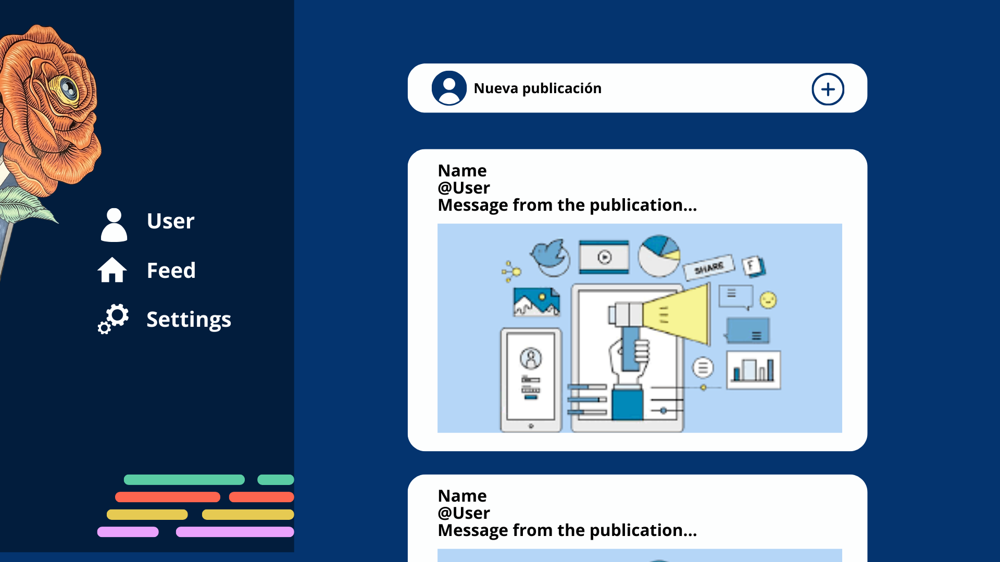
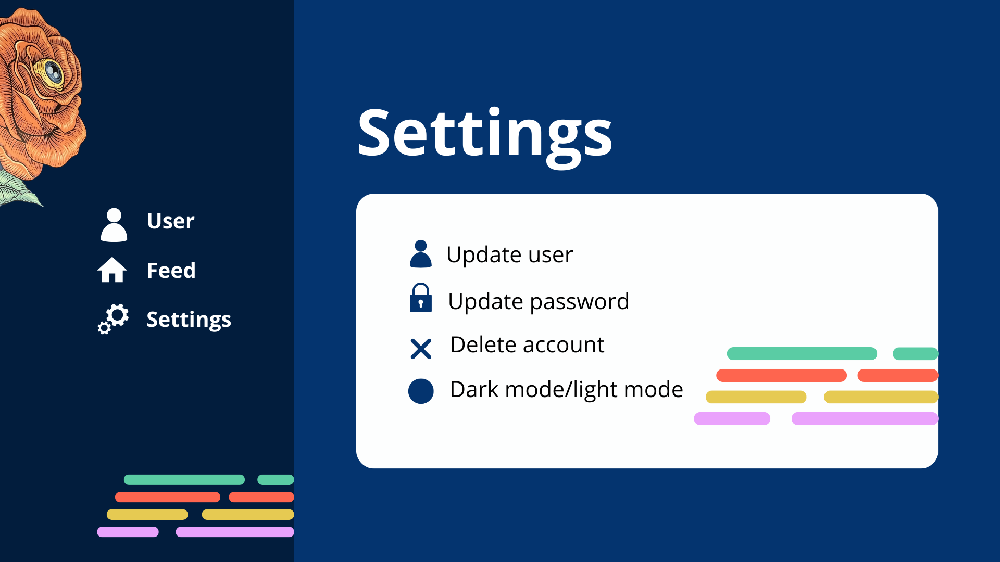

# Social Riwi

## Descripción
Esta documentación detalla el desarrollo de una red social dedicada al Clan Berners Lee del centro de entrenamiento Riwi en Medellín. Este proyecto surge como respuesta a la necesidad de establecer una plataforma que facilite la interacción y colaboración entre sus miembros, así como la difusión de contenido relacionado con la programación y proyectos. El grupo de desarrollo, integrado por Cristina Valencia Ospina, Sebastián Osorno Castrillón, Oscar Camilo Calle Gil y José Miguel Atehortúa, busca mediante esta iniciativa mejorar la conexión entre los miembros del clan Berners Lee y potenciar su desarrollo profesional en el ámbito de la programación.

## Índice
1. [Descripción General](#descripción-general)
2. [Historias de Usuario](#historias-de-usuario)
3. [Requisitos Funcionales](#requisitos-funcionales)
4. [Metodología de Desarrollo](#metodología-de-desarrollo)
5. [Equipo de Desarrollo](#equipo-de-desarrollo)
6. [Plan de Pruebas](#plan-de-pruebas)
7. [Diagrama de flujo](#diagrama-de-flujo)
8. [Prototipo](#prototipo)
9. [Tablero de actvidades](#tablero)

## Descripción General
### Objetivo General
Desarrollar una red social para el clan Berners Lee de nuestro centro de entrenamiento Riwi, facilitando la interacción y publicación de contenido entre sus miembros.

### Planteamiento del Problema
En el contexto del centro de entrenamiento, la falta de una plataforma dedicada limita la interacción y publicación efectiva entre los miembros del clan y otros clanes, así como la posibilidad de compartir información relacionada a la programación.

### Objetivos Específicos
- Crear una plataforma interactiva que permita a los miembros del clan Riwi compartir publicaciones e imágenes de proyectos.
- Facilitar la interacción entre los diferentes clanes dentro del centro de entrenamiento.
- Fomentar la colaboración y la interacción entre los miembros.

### Alcance del Proyecto
El desarrollo inicial se centrará en la implementación de la red social para el clan Berners Lee. Posteriormente, se tiene la intención de expandir la plataforma para servir a todo el centro de entrenamiento Riwi, ofreciendo una herramienta integral para la interacción entre todos los miembros, y crear una comunidad en línea donde desarrolladores de software puedan conectar, colaborar, compartir conocimientos, encontrar oportunidades laborales y proyectos.

## Historias de Usuario
### Perfiles de Usuario
- Creación de perfiles individuales para cada miembro del clan Riwi con información básica (nombre, biografía, intereses, skills) y foto de perfil.
- Capacidad de editar y actualizar el perfil de usuario.

### Publicaciones
- Capacidad para publicar contenido como texto, imágenes y videos relacionados con proyectos de programación.

### Privacidad y Seguridad
- Implementación de medidas de seguridad para proteger la privacidad de los usuarios y garantizar un entorno seguro en línea.
- Opciones de privacidad para controlar quién puede ver las publicaciones y el perfil del usuario.

### Búsqueda y Exploración
- Capacidad de buscar y explorar publicaciones y perfiles de otros usuarios.
- Sugerencias de contenido y usuarios relacionados basados en intereses y actividad.

### Gestión de Proyectos
- Capacidad de crear y administrar proyectos colaborativos dentro de la red social.
- Asignación de tareas y seguimiento del progreso de los proyectos.

## Requisitos Funcionales
### Escalabilidad
La plataforma debe ser capaz de manejar un crecimiento significativo de usuarios y actividad.

### Rendimiento
La aplicación debe proporcionar una experiencia fluida y rápida para los usuarios.

### Seguridad
Implementar medidas de seguridad adecuadas para proteger los datos de los usuarios y prevenir ataques.

### Accesibilidad
La interfaz de usuario debe ser accesible y cumplir con los estándares de accesibilidad web.

### Responsividad
La plataforma debe ser compatible con dispositivos móviles y adaptarse a diferentes tamaños de pantalla.

## Metodología de Desarrollo
Se seguirá una metodología ágil, como Scrum, para el desarrollo iterativo e incremental del proyecto.

- El proyecto se dividirá en sprints de duración fija, donde se planificarán, desarrollarán y revisarán las funcionalidades en cada iteración.
- Se realizarán reuniones diarias de sincronización (daily standups) para coordinar el trabajo y abordar cualquier obstáculo.
- Al final de cada sprint, se llevará a cabo una revisión del sprint y una retrospectiva para evaluar el progreso e identificar áreas de mejora.

## Equipo de Desarrollo
### Roles y responsabilidades
- **Product Owner**: Representante del cliente o de los usuarios finales, encargado de definir y priorizar los requisitos del producto.
- **Scrum Master**: Facilitador del proceso Scrum, responsable de eliminar obstáculos y garantizar que se sigan las prácticas ágiles.
- **Equipo de Desarrollo**: Desarrolladores front-end, back-end y de base de datos, responsables de implementar las funcionalidades del producto.
- **Diseñador de UX/UI**: Encargado de diseñar la interfaz de usuario y la experiencia de usuario de la aplicación.
- **Analista de Calidad**: Responsable de realizar pruebas funcionales y de asegurar la calidad del producto.

## Plan de Pruebas
- Se implementarán pruebas unitarias y de integración para garantizar la calidad del código.
- Se realizarán pruebas de usabilidad y de aceptación de usuario para validar que el producto cumple con los requisitos y expectativas.
- Se llevarán a cabo pruebas de rendimiento y de carga para asegurar que la aplicación pueda manejar un alto volumen de usuarios y actividad.
- Se implementarán pruebas de seguridad para identificar y mitigar posibles vulnerabilidades.

## Diagrama de flujo

## Prototipo

## Tablero
https://trello.com/invite/b/63Wwz9ZE/ATTI06bc147582a71b6f653553f5a819ef18E6F11F70/red-social-riwi

---
